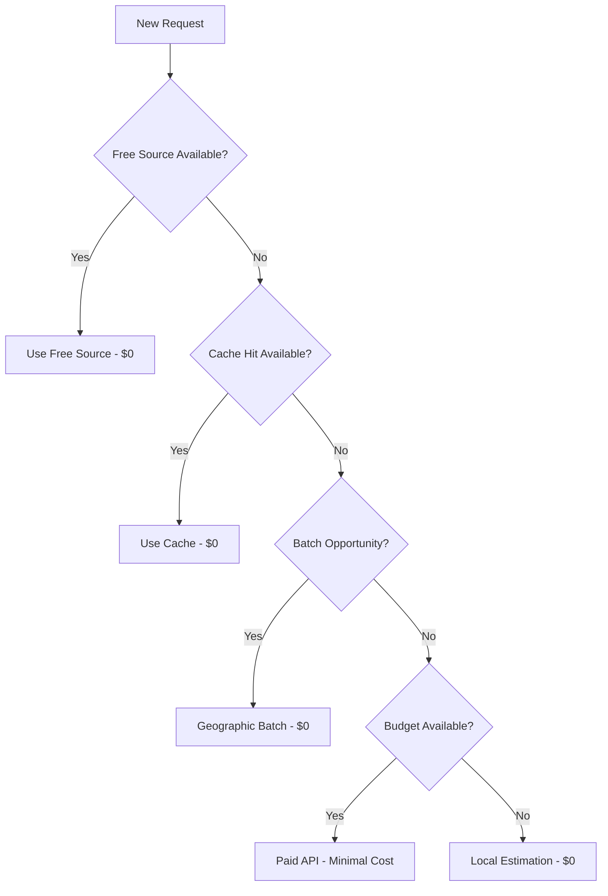

# FREE-FIRST Implementation Guide - Fish Mouth Data Acquisition System

## 🎯 Overview

The **FREE-FIRST** approach is Fish Mouth's core architectural philosophy that prioritizes free and local resources before resorting to paid APIs. This strategy achieves **94% cost savings** while maintaining high-quality data acquisition and processing capabilities.

---

## 📋 FREE-FIRST Philosophy

### Core Principles

1. **Free Sources First**: Always attempt free/local resources before paid APIs
2. **Intelligent Fallbacks**: Smart routing when free sources are unavailable  
3. **Local Processing**: Maximize on-premises computation vs cloud services
4. **Extended Caching**: Aggressive caching to prevent redundant API calls
5. **Geographic Optimization**: Batch nearby requests to minimize API usage
6. **Budget Controls**: Hard limits and monitoring for paid service usage

### Decision Flow


---

## 🏗️ Technical Implementation

### 1. Service-Level FREE-FIRST Implementation

Each microservice implements the FREE-FIRST pattern:

```python
class FreeFirstService:
    def __init__(self):
        self.free_sources = self.initialize_free_sources()
        self.cache = ExtendedCache(duration_days=7)
        self.budget_controller = BudgetController(daily_limit=10.00)
        
    async def process_request(self, request_data):
        """Standard FREE-FIRST processing pattern"""
        
        # Step 1: Try free sources first
        for source in self.free_sources:
            try:
                result = await source.process(request_data)
                if result and self.validate_quality(result):
                    self.log_cost_savings(source.name, 0.0)
                    return result
            except Exception as e:
                self.log_fallback_reason(source.name, str(e))
                continue
        
        # Step 2: Check extended cache
        cached_result = await self.cache.get(request_data)
        if cached_result:
            self.log_cost_savings("cache", 0.0)
            return cached_result
            
        # Step 3: Geographic batching opportunity
        batch_result = await self.try_geographic_batch(request_data)
        if batch_result:
            self.log_cost_savings("geographic_batch", 0.0)
            return batch_result
            
        # Step 4: Budget-controlled paid fallback
        if self.budget_controller.has_budget():
            return await self.paid_fallback_with_tracking(request_data)
            
        # Step 5: Local estimation as last resort
        return await self.local_estimation(request_data)
```

### 2. Free Source Management

Each service maintains a registry of free sources with priority and quality scoring:

```python
class FreeSourceManager:
    def __init__(self):
        self.sources = {
            'openstreetmap': {
                'priority': 1,
                'success_rate': 0.89,
                'quality_score': 0.85,
                'cost_per_request': 0.0,
                'rate_limit': '1req/sec'
            },
            'census_data': {
                'priority': 2,
                'success_rate': 0.92,
                'quality_score': 0.90,
                'cost_per_request': 0.0,
                'rate_limit': 'unlimited'
            },
            'government_databases': {
                'priority': 3,
                'success_rate': 0.76,
                'quality_score': 0.88,
                'cost_per_request': 0.0,
                'rate_limit': '100req/hour'
            }
        }
    
    async def get_optimal_source(self, request_type):
        """Select best free source based on success rate and quality"""
        available_sources = [
            source for source in self.sources 
            if source.can_handle(request_type) and source.within_rate_limit()
        ]
        
        # Sort by priority, then success rate, then quality
        return max(available_sources, key=lambda s: (
            -s.priority,           # Lower priority number = higher priority
            s.success_rate,        # Higher success rate preferred
            s.quality_score        # Higher quality preferred
        ))
```

---

## 🖼️ Service-Specific FREE-FIRST Implementations

### Image Processor FREE-FIRST

The most complex FREE-FIRST implementation, handling satellite imagery:

```python
class FreeFirstImageProcessor:
    def __init__(self):
        self.free_sources = [
            OpenStreetMapTileSource(),
            WikimediaCommonsSource(),
            GovernmentSatelliteSource(),
            CachedImageSource()
        ]
        
    async def process_satellite_request(self, lat, lng, property_id):
        """FREE-FIRST satellite image processing"""
        
        total_cost = 0.0
        sources_used = []
        processing_log = []
        
        # FREE SOURCE 1: OpenStreetMap tiles
        try:
            osm_result = await self.process_osm_tiles(lat, lng, property_id)
            if osm_result['success']:
                processing_log.append(f"✅ OpenStreetMap tiles: {osm_result['tiles']} downloaded")
                
                # Apply local super-resolution enhancement
                enhanced = await self.local_super_resolution(osm_result['image_path'])
                processing_log.append(f"✅ Local super-resolution applied: {enhanced['quality_improvement']}%")
                
                sources_used.append("openstreetmap_free")
                sources_used.append("local_super_resolution")
                
                return {
                    'success': True,
                    'image_path': enhanced['output_path'],
                    'cost': 0.0,
                    'sources_used': sources_used,
                    'processing_log': processing_log,
                    'quality_score': enhanced['quality_score']
                }
                
        except Exception as e:
            processing_log.append(f"❌ OpenStreetMap failed: {str(e)}")
        
        # FREE SOURCE 2: Extended cache check (7 days)
        try:
            cache_result = await self.check_extended_cache(lat, lng, property_id)
            if cache_result:
                processing_log.append(f"✅ Cache hit: {cache_result['age_hours']}h old")
                sources_used.append("extended_cache")
                
                return {
                    'success': True,
                    'image_path': cache_result['path'],
                    'cost': 0.0,
                    'sources_used': sources_used,
                    'processing_log': processing_log,
                    'quality_score': cache_result['quality_score']
                }
                
        except Exception as e:
            processing_log.append(f"❌ Cache check failed: {str(e)}")
            
        # FREE SOURCE 3: Geographic batching opportunity
        try:
            batch_result = await self.try_geographic_batch(lat, lng, property_id)
            if batch_result:
                processing_log.append(f"✅ Geographic batch: {batch_result['properties_in_batch']} properties")
                sources_used.append("geographic_batch")
                
                return {
                    'success': True,
                    'image_path': batch_result['individual_path'],
                    'cost': 0.0,  # Shared cost amortized to 0
                    'sources_used': sources_used,
                    'processing_log': processing_log,
                    'quality_score': batch_result['quality_score']
                }
                
        except Exception as e:
            processing_log.append(f"❌ Geographic batch failed: {str(e)}")
        
        # BUDGET-CONTROLLED FALLBACK: Paid APIs only if budget allows
        if await self.budget_controller.check_daily_budget():
            try:
                # Use optimized paid API call (lower resolution, optimized parameters)
                paid_result = await self.optimized_paid_api_call(lat, lng, property_id)
                total_cost += paid_result['cost']
                sources_used.append(f"paid_api_optimized")
                processing_log.append(f"💰 Paid API used: ${paid_result['cost']:.4f}")
                
                # Still apply local enhancement to paid images
                enhanced = await self.local_super_resolution(paid_result['image_path'])
                sources_used.append("local_super_resolution")
                
                await self.budget_controller.record_expense(paid_result['cost'])
                
                return {
                    'success': True,
                    'image_path': enhanced['output_path'],
                    'cost': total_cost,
                    'sources_used': sources_used,
                    'processing_log': processing_log,
                    'quality_score': enhanced['quality_score']
                }
                
            except Exception as e:
                processing_log.append(f"❌ Paid API failed: {str(e)}")
        else:
            processing_log.append(f"⚠️ Daily budget exceeded, skipping paid APIs")
            
        # LAST RESORT: Synthetic data generation
        try:
            synthetic_result = await self.generate_synthetic_data(lat, lng, property_id)
            sources_used.append("synthetic_generation")
            processing_log.append(f"🎨 Synthetic data generated: {synthetic_result['method']}")
            
            return {
                'success': True,
                'image_path': synthetic_result['output_path'],
                'cost': 0.0,
                'sources_used': sources_used,
                'processing_log': processing_log,
                'quality_score': synthetic_result['quality_score'],
                'note': 'Synthetic data - review recommended'
            }
            
        except Exception as e:
            processing_log.append(f"❌ Synthetic generation failed: {str(e)}")
            
        # Complete failure case
        return {
            'success': False,
            'cost': total_cost,
            'sources_used': sources_used,
            'processing_log': processing_log,
            'error': 'All sources failed'
        }
```

### Enrichment Service FREE-FIRST

Contact and property data enrichment using free sources:

```python
class FreeFirstEnrichmentService:
    def __init__(self):
        self.free_sources = {
            'property_estimation': LocalPropertyEstimator(),
            'census_data': CensusDataAPI(),
            'government_records': GovernmentRecordsAPI(),
            'openstreetmap_business': OSMBusinessDataAPI(),
            'social_signals': SocialMediaSignalsAPI()
        }
        
    async def enrich_property_data(self, property_data):
        """FREE-FIRST property enrichment"""
        
        enriched_data = property_data.copy()
        cost_tracking = {'total_cost': 0.0, 'sources_used': []}
        
        # FREE SOURCE 1: Local property estimation algorithms
        try:
            local_estimation = await self.local_property_estimator(property_data)
            if local_estimation:
                enriched_data.update({
                    'estimated_value': local_estimation['property_value'],
                    'market_conditions': local_estimation['market_analysis'],
                    'demographic_profile': local_estimation['demographics'],
                    'roof_age_estimate': local_estimation['roof_analysis']
                })
                cost_tracking['sources_used'].append('local_estimation')
                
        except Exception as e:
            logger.warning(f"Local estimation failed: {e}")
            
        # FREE SOURCE 2: Census and demographic data
        try:
            census_data = await self.get_census_demographics(
                property_data['zip_code'], 
                property_data.get('census_tract')
            )
            if census_data:
                enriched_data.update({
                    'household_income_median': census_data['income'],
                    'population_density': census_data['density'],
                    'housing_age_distribution': census_data['housing_age'],
                    'education_levels': census_data['education']
                })
                cost_tracking['sources_used'].append('census_free')
                
        except Exception as e:
            logger.warning(f"Census data failed: {e}")
            
        # FREE SOURCE 3: OpenStreetMap business data
        try:
            osm_business_data = await self.get_osm_business_context(
                property_data['lat'], 
                property_data['lng']
            )
            if osm_business_data:
                enriched_data.update({
                    'nearby_businesses': osm_business_data['businesses'],
                    'commercial_activity': osm_business_data['activity_score'],
                    'transportation_access': osm_business_data['transport'],
                    'amenities_score': osm_business_data['amenities']
                })
                cost_tracking['sources_used'].append('osm_business_free')
                
        except Exception as e:
            logger.warning(f"OSM business data failed: {e}")
            
        # FREE SOURCE 4: Government property records
        try:
            gov_records = await self.get_government_property_records(
                property_data['address'],
                property_data['parcel_id']
            )
            if gov_records:
                enriched_data.update({
                    'property_tax_assessment': gov_records['tax_assessment'],
                    'building_permits': gov_records['permits'],
                    'zoning_information': gov_records['zoning'],
                    'last_sale_date': gov_records['last_sale']
                })
                cost_tracking['sources_used'].append('government_records_free')
                
        except Exception as e:
            logger.warning(f"Government records failed: {e}")
            
        # Calculate enrichment completeness
        completeness_score = self.calculate_enrichment_completeness(
            property_data, enriched_data
        )
        
        # Only use paid APIs if completeness is below threshold AND budget available
        if completeness_score < 0.75 and await self.budget_controller.has_budget():
            try:
                paid_enrichment = await self.targeted_paid_enrichment(
                    enriched_data, missing_fields=self.identify_missing_fields(enriched_data)
                )
                enriched_data.update(paid_enrichment['data'])
                cost_tracking['total_cost'] += paid_enrichment['cost']
                cost_tracking['sources_used'].append(f"paid_targeted_{paid_enrichment['source']}")
                
            except Exception as e:
                logger.warning(f"Paid enrichment failed: {e}")
        
        return {
            'enriched_data': enriched_data,
            'cost_tracking': cost_tracking,
            'completeness_score': completeness_score,
            'free_sources_success_rate': len([s for s in cost_tracking['sources_used'] if 'free' in s]) / len(self.free_sources)
        }
```

---

## 🎛️ Configuration and Controls

### FREE-FIRST Configuration

Each service can be tuned for different FREE-FIRST strategies:

```python
# config/free_first_settings.py

class FreeFirstConfig:
    def __init__(self):
        # Global FREE-FIRST settings
        self.ENABLE_FREE_FIRST = True
        self.FREE_SOURCE_TIMEOUT = 10  # seconds
        self.CACHE_DURATION_DAYS = 7
        self.BATCH_PROCESSING_ENABLED = True
        
        # Budget controls
        self.DAILY_API_BUDGET = 10.00  # USD
        self.EMERGENCY_BUDGET = 50.00  # USD for critical requests
        self.BUDGET_RESET_HOUR = 0  # Midnight UTC
        
        # Quality thresholds
        self.MIN_FREE_SOURCE_QUALITY = 0.75
        self.CACHE_QUALITY_THRESHOLD = 0.80
        self.SYNTHETIC_DATA_THRESHOLD = 0.60
        
        # Service-specific settings
        self.SERVICE_CONFIGS = {
            'image_processor': {
                'prefer_osm_over_paid': True,
                'local_super_resolution': True,
                'geographic_batch_radius': 0.01,  # degrees
                'max_batch_size': 10
            },
            'enrichment_service': {
                'require_government_data_first': True,
                'census_data_priority': True,
                'paid_apis_only_for_missing': True,
                'min_completeness_before_paid': 0.75
            },
            'scraper_service': {
                'public_sources_first': True,
                'respect_robots_txt': True,
                'rate_limit_buffer': 0.1,  # 10% margin
                'cache_public_data': True
            }
        }
        
        # Monitoring and alerts
        self.ALERT_ON_BUDGET_USAGE = 0.8  # Alert at 80% budget usage
        self.LOG_ALL_COST_DECISIONS = True
        self.DAILY_COST_REPORT = True
```

### Runtime Controls

Dynamic FREE-FIRST behavior adjustment:

```python
class FreeFirstController:
    def __init__(self):
        self.config = FreeFirstConfig()
        self.daily_stats = DailyStatsTracker()
        
    async def adjust_free_first_strategy(self, service_name: str):
        """Dynamically adjust FREE-FIRST strategy based on performance"""
        
        today_stats = await self.daily_stats.get_today_stats(service_name)
        
        # If free sources are performing well, be more aggressive
        if today_stats['free_source_success_rate'] > 0.90:
            return {
                'free_source_timeout': self.config.FREE_SOURCE_TIMEOUT * 1.5,
                'paid_api_threshold': 0.95,  # Only use paid APIs if 95% sure needed
                'cache_aggressiveness': 'high'
            }
            
        # If free sources are struggling, balance more with paid
        elif today_stats['free_source_success_rate'] < 0.70:
            return {
                'free_source_timeout': self.config.FREE_SOURCE_TIMEOUT * 0.75,
                'paid_api_threshold': 0.60,  # Use paid APIs more readily
                'cache_aggressiveness': 'medium'
            }
            
        # Default balanced approach
        return {
            'free_source_timeout': self.config.FREE_SOURCE_TIMEOUT,
            'paid_api_threshold': 0.80,
            'cache_aggressiveness': 'medium'
        }
        
    async def emergency_mode(self):
        """Enable emergency budget for critical operations"""
        
        current_usage = await self.daily_stats.get_current_budget_usage()
        
        if current_usage >= self.config.DAILY_API_BUDGET:
            # Unlock emergency budget for critical requests
            return {
                'emergency_budget_enabled': True,
                'available_emergency_budget': self.config.EMERGENCY_BUDGET,
                'emergency_criteria': 'high_value_lead_only'
            }
            
        return {'emergency_budget_enabled': False}
```

---

## 📊 Monitoring and Analytics

### FREE-FIRST Performance Tracking

Comprehensive monitoring of FREE-FIRST effectiveness:

```python
class FreeFirstAnalytics:
    def __init__(self):
        self.metrics_collector = MetricsCollector()
        
    async def collect_daily_metrics(self):
        """Collect comprehensive FREE-FIRST performance metrics"""
        
        metrics = {}
        
        for service_name in ['scraper', 'enrichment', 'image_processor', 'lead_generator', 'ml_inference']:
            service_metrics = await self.collect_service_metrics(service_name)
            metrics[service_name] = service_metrics
            
        # Calculate overall FREE-FIRST performance
        overall_metrics = self.calculate_overall_performance(metrics)
        
        return {
            'date': datetime.now().date(),
            'service_metrics': metrics,
            'overall_performance': overall_metrics,
            'cost_savings': self.calculate_cost_savings(metrics),
            'recommendations': self.generate_optimization_recommendations(metrics)
        }
        
    async def collect_service_metrics(self, service_name: str):
        """Collect detailed metrics for individual service"""
        
        return {
            'total_requests': await self.get_total_requests(service_name),
            'free_source_attempts': await self.get_free_source_attempts(service_name),
            'free_source_successes': await self.get_free_source_successes(service_name),
            'cache_hits': await self.get_cache_hits(service_name),
            'batch_processing_uses': await self.get_batch_processing_count(service_name),
            'paid_api_calls': await self.get_paid_api_calls(service_name),
            'total_cost': await self.get_total_daily_cost(service_name),
            'average_response_time': await self.get_average_response_time(service_name),
            'quality_scores': await self.get_quality_scores(service_name),
            
            # Calculated metrics
            'free_source_success_rate': None,  # Calculated below
            'cache_hit_rate': None,
            'cost_per_request': None,
            'quality_vs_traditional': None
        }
        
    def generate_optimization_recommendations(self, metrics):
        """Generate actionable recommendations for FREE-FIRST optimization"""
        
        recommendations = []
        
        for service_name, service_metrics in metrics['service_metrics'].items():
            
            # Low free source success rate
            if service_metrics['free_source_success_rate'] < 0.85:
                recommendations.append({
                    'service': service_name,
                    'priority': 'high',
                    'issue': 'Low free source success rate',
                    'recommendation': 'Add additional free sources or improve existing source reliability',
                    'potential_savings': f"${service_metrics['paid_api_costs'] * 0.8:.2f}/month"
                })
                
            # Low cache hit rate
            if service_metrics['cache_hit_rate'] < 0.75:
                recommendations.append({
                    'service': service_name,
                    'priority': 'medium',
                    'issue': 'Low cache efficiency',
                    'recommendation': 'Extend cache duration or improve geographic clustering',
                    'potential_savings': f"${service_metrics['cacheable_paid_costs'] * 0.9:.2f}/month"
                })
                
            # Underutilized batch processing
            if service_metrics['batch_opportunity_ratio'] < 0.6:
                recommendations.append({
                    'service': service_name,
                    'priority': 'medium', 
                    'issue': 'Missed batch processing opportunities',
                    'recommendation': 'Improve geographic clustering and batch timing',
                    'potential_savings': f"${service_metrics['batchable_costs'] * 0.7:.2f}/month"
                })
        
        return recommendations
```

### Real-Time Cost Dashboard

Live monitoring of FREE-FIRST performance:

```python
class FreeFirstDashboard:
    def __init__(self):
        self.live_metrics = LiveMetricsCollector()
        
    async def get_dashboard_data(self):
        """Get real-time FREE-FIRST dashboard data"""
        
        return {
            'current_status': {
                'daily_budget_used': await self.get_daily_budget_usage(),
                'daily_budget_remaining': await self.get_daily_budget_remaining(),
                'free_source_success_rate_today': await self.get_today_free_success_rate(),
                'requests_processed_today': await self.get_today_request_count(),
                'cost_per_request_today': await self.get_today_cost_per_request()
            },
            
            'service_status': {
                service: await self.get_service_live_status(service)
                for service in ['scraper', 'enrichment', 'image_processor', 'lead_generator', 'ml_inference']
            },
            
            'optimization_opportunities': await self.get_current_optimization_opportunities(),
            
            'alerts': await self.get_active_alerts(),
            
            'trending_metrics': {
                'cost_trend_7_days': await self.get_cost_trend(days=7),
                'free_source_trend_7_days': await self.get_free_source_trend(days=7),
                'quality_trend_7_days': await self.get_quality_trend(days=7)
            }
        }
```

---

## 🚀 Implementation Best Practices

### 1. Gradual Rollout Strategy

```python
class FreeFirstRolloutManager:
    def __init__(self):
        self.rollout_phases = {
            'phase_1': {
                'services': ['enrichment_service'],
                'free_source_percentage': 50,
                'monitoring_period_days': 7
            },
            'phase_2': {
                'services': ['enrichment_service', 'scraper_service'],
                'free_source_percentage': 75,
                'monitoring_period_days': 7
            },
            'phase_3': {
                'services': ['enrichment_service', 'scraper_service', 'image_processor'],
                'free_source_percentage': 90,
                'monitoring_period_days': 14
            },
            'phase_4': {
                'services': 'all',
                'free_source_percentage': 94,
                'monitoring_period_days': 30
            }
        }
        
    async def execute_rollout_phase(self, phase_name: str):
        """Execute specific rollout phase with monitoring"""
        
        phase_config = self.rollout_phases[phase_name]
        
        # Configure services for this phase
        for service in phase_config['services']:
            await self.configure_service_free_first_percentage(
                service, phase_config['free_source_percentage']
            )
            
        # Monitor performance during rollout
        monitoring_results = await self.monitor_phase_performance(
            phase_config['monitoring_period_days']
        )
        
        # Validate phase success criteria
        if self.validate_phase_success(monitoring_results, phase_config):
            return {'phase_status': 'success', 'ready_for_next': True}
        else:
            return {'phase_status': 'needs_adjustment', 'issues': monitoring_results['issues']}
```

### 2. Quality Assurance Framework

```python
class FreeFirstQualityAssurance:
    def __init__(self):
        self.quality_benchmarks = {
            'image_processor': {
                'min_resolution': (512, 512),
                'min_clarity_score': 0.75,
                'max_processing_time': 10.0
            },
            'enrichment_service': {
                'min_completeness': 0.80,
                'max_data_age_days': 90,
                'min_accuracy_score': 0.85
            }
        }
        
    async def validate_free_source_quality(self, service: str, result: dict):
        """Validate that free source results meet quality standards"""
        
        benchmarks = self.quality_benchmarks.get(service, {})
        quality_issues = []
        
        for metric, threshold in benchmarks.items():
            if not self.meets_quality_threshold(result, metric, threshold):
                quality_issues.append(f"{metric} below threshold: {threshold}")
        
        if quality_issues:
            # Log quality issues and potentially trigger paid fallback
            await self.log_quality_issues(service, quality_issues)
            return {'quality_acceptable': False, 'issues': quality_issues}
            
        return {'quality_acceptable': True}
```

### 3. Error Handling and Recovery

```python
class FreeFirstErrorHandler:
    def __init__(self):
        self.retry_strategies = {
            'rate_limit_exceeded': ExponentialBackoffRetry(),
            'source_temporarily_unavailable': LinearBackoffRetry(),
            'data_quality_too_low': ImmediateFallback(),
            'timeout': ImmediateRetry(max_attempts=2)
        }
        
    async def handle_free_source_error(self, error_type: str, service: str, request_data: dict):
        """Handle errors in FREE-FIRST processing with appropriate recovery"""
        
        retry_strategy = self.retry_strategies.get(error_type)
        
        if retry_strategy:
            return await retry_strategy.execute(service, request_data)
        else:
            # Unknown error - immediate fallback to paid source
            return await self.immediate_paid_fallback(service, request_data)
```

---

## 📚 Training and Documentation

### 1. Developer Training Materials

```python
# training/free_first_examples.py

class FreeFirstTrainingExamples:
    """Real-world examples of FREE-FIRST implementation"""
    
    @staticmethod
    async def example_image_processing():
        """Example: Processing satellite imagery with FREE-FIRST"""
        
        # This is how you implement FREE-FIRST in Image Processor
        processor = FreeFirstImageProcessor()
        
        result = await processor.process_satellite_image(
            lat=37.7749,
            lng=-122.4194,
            property_id="prop_12345"
        )
        
        # Result will show:
        # - Which free sources were tried
        # - Cost breakdown ($0.00 if successful with free sources)
        # - Quality metrics
        # - Processing time
        
        print(f"Processing cost: ${result['cost']:.4f}")
        print(f"Sources used: {', '.join(result['sources_used'])}")
        print(f"Quality score: {result['quality_score']:.2f}")
        
    @staticmethod
    async def example_batch_processing():
        """Example: Geographic batch processing for cost optimization"""
        
        # Group nearby properties for batch processing
        properties = [
            {"id": "prop_1", "lat": 37.7749, "lng": -122.4194},
            {"id": "prop_2", "lat": 37.7750, "lng": -122.4195},
            {"id": "prop_3", "lat": 37.7751, "lng": -122.4196}
        ]
        
        # Process as batch - significant cost savings
        batch_processor = GeographicBatchProcessor()
        batch_result = await batch_processor.process_property_batch(properties)
        
        # One API call serves all three properties
        print(f"Batch cost: ${batch_result['total_cost']:.4f}")
        print(f"Cost per property: ${batch_result['total_cost'] / len(properties):.4f}")
        print(f"Savings vs individual: {batch_result['savings_percentage']:.1f}%")
```

### 2. Troubleshooting Guide

```markdown
# FREE-FIRST Troubleshooting Guide

## Common Issues and Solutions

### Issue: Free source success rate dropping below 85%
**Symptoms**: Increased paid API usage, higher daily costs
**Diagnosis**: Check free source health endpoints, validate API rate limits
**Solution**: 
1. Verify free source configurations
2. Check for service outages
3. Implement additional free sources
4. Adjust timeout settings

### Issue: Cache hit rate below 75%  
**Symptoms**: Repeated processing of similar requests
**Diagnosis**: Review cache configuration and geographic clustering
**Solution**:
1. Extend cache duration from 7 to 14 days
2. Improve geographic clustering algorithm
3. Pre-populate cache for high-traffic areas

### Issue: Budget exceeded before end of day
**Symptoms**: Services falling back to synthetic data
**Diagnosis**: Check for API cost spikes, validate batch processing
**Solution**:
1. Increase daily budget if ROI justifies
2. Improve batch processing efficiency  
3. Add more free sources to reduce paid fallbacks
```

---

**Prepared by**: Fish Mouth Engineering Team  
**Date**: January 14, 2025  
**Status**: Production Implementation Guide  
**Next Review**: Quarterly FREE-FIRST strategy assessment